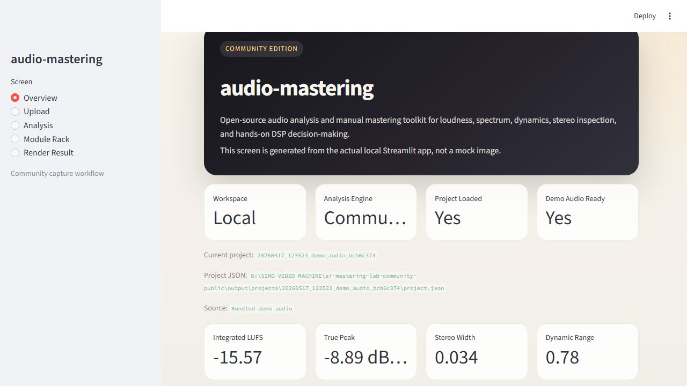
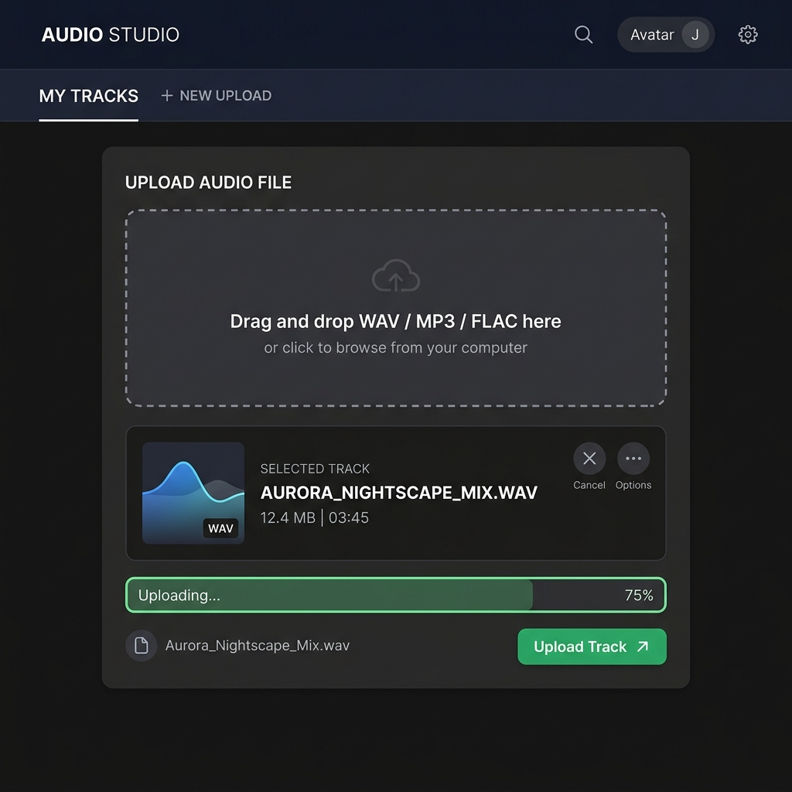
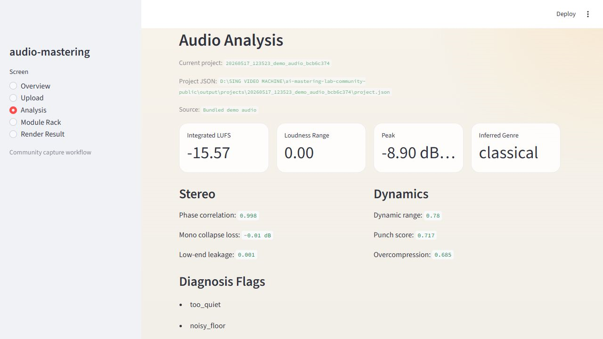
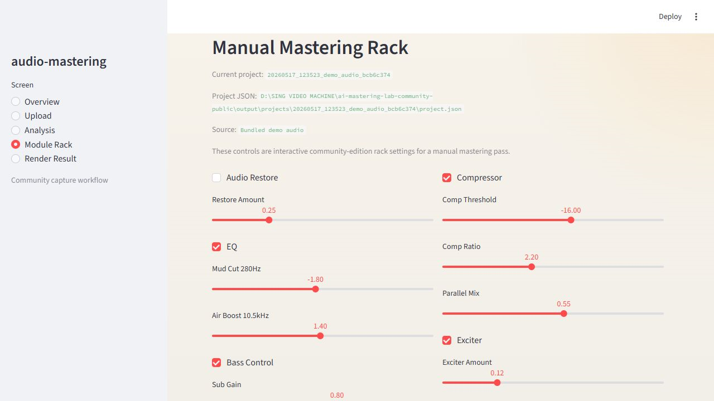
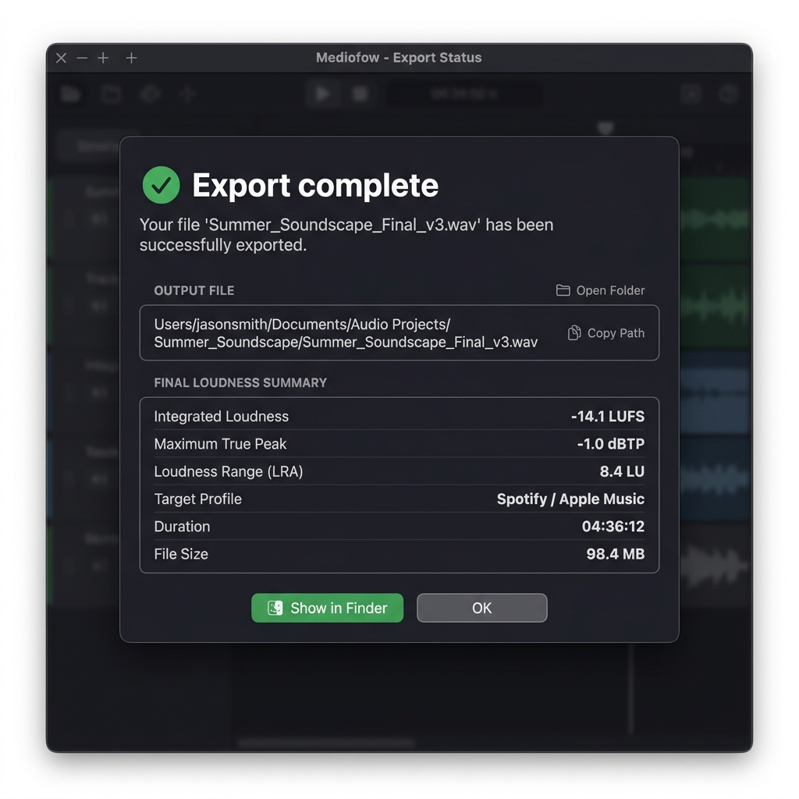

# audio-mastering


audio-mastering is an open-source audio analysis and manual mastering toolkit.

It provides loudness analysis, spectrum analysis, dynamics analysis, stereo analysis, basic DSP modules, and manual mastering workflows.

## Quick Start Guide

For a more detailed guide, see [docs/QUICK_START.md](docs/QUICK_START.md).

## Features

- Loudness analysis
- Spectrum analysis
- Dynamics analysis
- Stereo analysis
- Basic DSP modules
- Manual mastering workflow
- Optional stem separation interface

## What This Is Not

This repository does not include the proprietary Pro engine:

- AI Master Assistant
- Automatic mastering decision engine
- Genre-specific profiles
- Pro rendering orchestration
- Commercial presets
- Pro QC workflow

## Quick Start

For Windows:

```bash
git clone https://github.com/kyejin1991/AUDIO-MASTERING.git
cd AUDIO-MASTERING
python -m venv .venv
.venv\Scripts\activate
pip install -r requirements.txt
streamlit run app.py
```

For macOS / Linux:

```bash
git clone https://github.com/kyejin1991/AUDIO-MASTERING.git
cd AUDIO-MASTERING
python3 -m venv .venv
source .venv/bin/activate
pip install -r requirements.txt
streamlit run app.py
```

## Screenshots

### Overview



### Audio Upload



### Audio Analysis



### Manual Mastering Rack



### Render Result



## Quick Start Video

The 15-second quick start video is available in the GitHub Release assets:

[View release assets](https://github.com/kyejin1991/AUDIO-MASTERING/releases/tag/v0.1.0-community)

## Third-Party Components

This project uses third-party open-source components including Demucs and pyloudnorm.

See:

- [THIRD_PARTY_LICENSES.md](THIRD_PARTY_LICENSES.md)
- [NOTICE](NOTICE)

## Community / Pro Boundary

| Edition | Status | Included |
|---|---|---|
| Community | Open Source | Analysis, basic DSP, manual mastering |
| Pro | Proprietary | AI decision engine, automatic mastering, genre profiles |

This Community Edition does not include the proprietary AI Master Assistant, automatic mastering decision engine, genre-specific Pro profiles, Pro rendering orchestration, commercial presets, or Pro QC workflow.

## License

See [LICENSE](LICENSE).

## Author

Developed by [kyejin1991](https://github.com/kyejin1991)  
© 2026 Arcapps
